# MIDI import process

This guide describes the current schema-v4 import implementation. Reviewed
beat-grid alignment and occurrence-local harmony fitting are now separate,
hash-bound preparation stages; the remaining canonical-full-melody work is
specified in [`plan/PLAN.md`](plan/PLAN.md).

Use **Import MIDI** for editable Standard MIDI files. Use **Import audio** only
for an eligible solo-piano or isolated melody WAV/WAVE/MP3 source. The current
Basic Pitch route is not stem separation and does not promise useful melody MIDI
from a full mix.

```mermaid
flowchart LR
    S[Choose source] --> V[Validate extension and container]
    V -->|.mid/.midi| R[Preserve source and publish raw MIDI]
    V -->|isolated .wav/.wave/.mp3| I[Inspect/select original or prepared audio]
    I --> T[Basic Pitch transcription]
    T --> R
    R --> C[Clean MIDI]
    C --> N[Normalize MIDI]
    N --> M[Review source timing / publish alignment candidate]
    M --> K[Detect/confirm source key]
    K --> P[Transpose to project key]
    P --> O[Optional correction, AI Fix, Enhance, Feel]
    O --> A[Analyze selected MIDI]
```

## Source validation and immutability

Direct MIDI accepts `.mid` and `.midi`; audio accepts `.wav`, `.wave`, and
`.mp3`. The service checks the actual container and bounded content, not only
the suffix. Invalid identifiers, escaping paths, malformed MIDI, unsupported
audio, missing playable notes, and non-positive duration are rejected.

The imported file is copied beneath `source/` and remains immutable. Every
processor publishes a separate project-relative candidate and report. Failed,
stale, rejected, and bypassed artifacts may remain as inspection evidence but
cannot become selected by file existence.

## Direct MIDI route

1. Preserve the original file under `source/<part>.<ext>`.
2. Publish immutable `midi/raw/<part>.mid` evidence.
3. Run deterministic cleanup and review its quality evidence when required.
4. Normalize timing representation conservatively.
5. Detect source key; confirm it when confidence is below the fixed gate.
6. Publish a separate project-key-transposed candidate and report.

## Isolated audio route

1. Preserve the original audio under `source/<part>.<ext>`.
2. Inspection writes `prepared/<part>/report.json` without modifying audio.
3. Explicit safe preparation may publish `prepared/<part>/decoded.wav` and
   `prepared/<part>/clean.wav`; it never overwrites the source, removes time,
   changes pitch/tempo, normalizes loudness, or separates stems.
4. Transcribe the selected original/prepared input through the optional local
   Basic Pitch runtime.
5. Validate and atomically publish `midi/raw/<part>.mid`.
6. Apply the mandatory transcription cleanup profile before analysis-ready
   progression.

If the optional model/runtime is unavailable or output validation fails, the
source remains intact and no invalid raw MIDI is selected. Follow
[`worker/README.md`](../worker/README.md) for the supported Python environment.

## Current MIDI evidence

| Evidence | Current path and meaning |
| --- | --- |
| Imported source | `source/<part>.<ext>` — immutable imported MIDI/audio |
| Inspection | `prepared/<part>/report.json` — measured input evidence |
| Optional prepared audio | `prepared/<part>/decoded.wav`, `prepared/<part>/clean.wav` |
| Raw MIDI | `midi/raw/<part>.mid` — direct copy or validated transcription |
| Clean MIDI | `midi/clean/<part>.mid` |
| Cleanup quality | `midi/quality/<part>.json` |
| Normalized MIDI | `midi/normalized/<part>-<run>.mid` plus normalization report |
| Timing evidence | `analysis/timing/<part>/<hash>.json` — source beat/onset/downbeat and groove evidence |
| Reviewed timing candidate | `midi/timing/<part>/<hash>.mid` plus `analysis/timing-mapping/<part>/<hash>.json` |
| Transposed MIDI | `midi/transposed/<part>-<run>.mid` plus transposition report |
| Monophonic prepared MIDI | `midi/prepared/<part>/<hash>.mid` plus `analysis/melody-preparation/<part>/<hash>.json` |
| Harmony-fitted MIDI | `midi/harmony-fit/<part>/<occurrence>/<hash>.mid` plus `analysis/harmony-fit/<part>/<occurrence>/<hash>.json` |
| Optional fixed Feel | `midi/feel/<part>/<context-hash>/derived.mid` and `midi/feel/<part>/<context-hash>/report.json`, each bound to the exact selected upstream artifact, profile, and processor version |

The selected branch follows one order: transposed -> Technical Correction -> AI
Fix -> per-track Enhance -> optional Feel. Selection and approval are
hash/context/processor-bound; an unselected branch cannot override the current
candidate, and zero-edit Enhance is recorded as `NO_OP`.

## Important current musical limitations

- QP-002 collects bounded source beat/onset/tempo/downbeat and groove evidence
  through the local worker. QP-003 accepts only an immutable reviewed timing
  decision, piecewise maps it to the declared project tempo/meter, and records
  zero-anchor-phase residual evidence. The result is a separate content-addressed
  candidate: it never overwrites normalized or transposed MIDI. Low-support
  groove evidence must explicitly fall back to the grid; it is not invented
  from silence or silently copied into a candidate.
- QP-004 maps recognized source-scale degrees to the corresponding target-scale
  degrees when source and project modes differ. Chromatic source notes remain
  explicit unresolved evidence under the bounded tonic fallback; they are not
  silently treated as scale tones.
- QP-005 turns the selected MIDI for each source section into a separate,
  content-addressed one-track monophonic candidate. Its report records source
  note/controller identities, sustain-aware effective ends, every reduction
  decision, and any safe blocking ambiguity; selected MIDI remains unchanged.
- QP-006 fits every QP-005 candidate against the authoritative harmony active
  in its exact structure occurrence. It preserves only short weak scale
  passing tones, explicitly authorized chromatic chord tones, and evidenced
  common-tone ties or suspensions. Exposed clashes are repaired only within a
  bounded movement/edit policy; ambiguous or excessive repairs block. Pedal
  and transcription tails are shortened under a versioned tempo/PPQ-derived
  gap policy before incompatible chord boundaries. The original selected MIDI
  and QP-005 candidate remain immutable.
- Source-song assembly now requires both reports and publishes an immutable
  v2 candidate with one conductor and one controller-free full-melody track.
  Its sidecar persists exact occurrence windows, markers, harmony, source and
  preparation hashes, post-fit anchors, note lineage, and an occurrence-indexed
  groove map. Melody Connection and Source Song Critic use that assembled
  identity. Arrangement, Cohesion, critics, humanization, preview, stem render,
  and release evidence use the exact approved connected candidate; local views
  are clipped through its sidecar windows and cannot fall back to selected parts.

QP-010 verifies the exact connected MIDI against the explicit bar/pickup/body/
tail windows, global monophony, QP-006 eligibility and boundary evidence,
protected anchors, groove coverage, source-key confirmation, and canonical
lineage. Hard findings cannot be overridden. A recorded override of an ordinary
blocker is private-audition evidence only and labels downstream use
experimental; it cannot satisfy a quality-certified flow. The remaining musical
planning limits are tracked by QP-011.

## Recovery

- **Corrupt/unsupported source:** choose a valid supported isolated source.
- **Worker or Basic Pitch unavailable:** start/configure the worker, then retry
  transcription; do not re-import solely to clear an error.
- **Cleanup review required:** compare raw/cleaned MIDI and approve the exact
  current report.
- **Low-confidence key:** choose the source tonic/mode explicitly before
  transposition.
- **Stale derived evidence:** regenerate from the earliest changed selected
  input; never copy an old MIDI forward or delete it to fake readiness.
- **MIDI preview unavailable:** configure the validated sound library, samples,
  `sfizz_render`, and an audio output device.

See [Track process workflow](TRACK_PROCESS_WORKFLOW.md) for the current full
project order and [Desktop troubleshooting](TROUBLESHOOTING.md) for dependency
setup.
