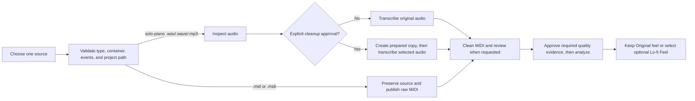

# MIDI import process

Use **Import MIDI** when you already have editable MIDI. Use **Import audio**
only for an eligible solo-piano WAV, WAVE, or MP3 source that you want to
transcribe. Audio import does not promise a particular transcription quality:
review the published MIDI before it becomes analysis input.

## Choose and validate the source

Direct MIDI accepts only `.mid` and `.midi`. Validation is layered: import
checks the extension and Standard MIDI header before it preserves source
evidence; **Inspect only** verifies the actual Standard MIDI container,
rejects corrupt or unsupported data, and requires playable events with a
positive duration. The later quality review also requires supported PPQ timing
and well-formed note pairs. A filename extension alone is never proof that a
file is MIDI.

WAV (`.wav` or `.wave`) and MP3 (`.mp3`) are accepted only for the
solo-piano transcription route. The worker validates their actual RIFF/WAVE or
MPEG container and bounded decoded format before reporting measurements.

Every import is copied into the open project. Part IDs, artifact references,
and source identities are validated; canonical paths are project-relative and
confined below the project root. Do not point a report or a derived artifact at
an arbitrary external path.

## The two routes

### Direct MIDI

1. Import the valid `.mid` or `.midi` file.
2. Melotrail copies it as immutable source evidence at
   `source/<part>.<ext>` and atomically publishes the same MIDI as
   `midi/raw/<part>.mid`.
3. Run **Clean MIDI**. Import does not clean, analyze, or silently alter the
   MIDI.

### Solo-piano audio to MIDI

1. Import an eligible WAV/WAVE/MP3 recording. The original is copied to
   `source/<part>.<ext>` and remains immutable.
2. Use **Inspect only** to create `prepared/<part>/report.json`. Inspection
   measures the source and does not create editable MIDI or change audio.
3. If the report calls for it, explicitly approve conservative cleanup. The
   resulting derived copies can be `prepared/<part>/decoded.wav` and
   `prepared/<part>/clean.wav`; the original source is never overwritten.
4. Select the original or validated prepared input and transcribe it with the
   local worker's optional Basic Pitch runtime. Only a validated output is
   atomically published as immutable `midi/raw/<part>.mid`.
5. Continue with **Clean MIDI**, just as for direct MIDI.

The worker accepts only the `piano` transcription instrument. It checks the
published result is MIDI with notes in the piano range, a bounded note rate,
and timing that matches the selected audio input. A failed or invalid result
does not replace an existing raw MIDI artifact; a parseable rejected result can
remain as project-local diagnostic evidence.

## MIDI evidence and review

| Term | Canonical artifact | What it means |
| --- | --- | --- |
| Source evidence | `source/<part>.<ext>` | The immutable imported MIDI or audio file. |
| Inspection report | `prepared/<part>/report.json` | Versioned, measured evidence for an imported source; audio cleanup/transcription selection is recorded here. |
| Raw MIDI | `midi/raw/<part>.mid` | Immutable direct-MIDI evidence or a validated transcription output. It is not yet analysis-ready. |
| Cleaned MIDI and quality evidence | `midi/clean/<part>.mid` and `midi/quality/<part>.json` | A separately published cleanup output plus its current quality report. Review it and explicitly approve it whenever the report requires approval before analysis. Approval is bound to the exact raw, cleaned, options, and report fingerprints. |
| Optional Lo-fi Feel | `midi/derived/<part>/lofi-80-swing-v1.mid` and `midi/feel/<part>/lofi-80-swing-v1.json` | An opt-in derived analysis input (fixed 80 BPM, 58% eighth-note swing). **Original feel** keeps the cleaned MIDI selected. |

Clean MIDI and Lo-fi Feel never overwrite the source, raw MIDI, or cleaned MIDI.
Changing raw MIDI, cleanup evidence, or the selected feel makes later analysis
stale. Keep stale files for inspection, then rerun the earliest affected stage;
do not copy an old artifact forward.

## Errors and recovery

The **Import** page keeps its one current source/repair/analysis action visible.
Use the selected part's labelled details or preparation disclosure for optional
inspection, cleanup choice, transcription input, and evidence; those controls
do not bypass the next required workflow stage.

- **Unsupported or corrupt input:** choose one of the supported extensions,
  verify its real container, and re-import it. For MIDI, use a Standard MIDI
  file with playable events; for audio, use the narrow solo-piano route.
- **Transcription runtime unavailable:** start the worker with `make worker`
  after configuring the optional Basic Pitch runtime in Python 3.11 as
  described in [`worker/README.md`](../worker/README.md). Re-run transcription
  after readiness succeeds.
- **Invalid model output:** no raw MIDI is published from invalid output.
  Inspect the report and any project-local diagnostic MIDI, correct the input
  or runtime, then transcribe again. This is a validation failure, not a
  statement about the musical quality of a different recording.
- **Stale quality evidence:** run **Clean MIDI** again, inspect the cleaned
  MIDI and `midi/quality/<part>.json`, then approve the current report when the
  workspace asks for it before analysis.
- **Preview renderer unavailable:** audio-source monitoring may still work,
  but MIDI preview requires a validated sound library, its samples, an audio
  output device, and a configured local `sfizz_render`. Follow the readiness
  message, refresh, and retry. A disabled or failed preview is not proof that
  playback started.

For the complete project stage order, see the
[track process workflow](TRACK_PROCESS_WORKFLOW.md). For worker setup and
transcription limits, see [`worker/README.md`](../worker/README.md).
