# MIDI import process

This guide describes the current schema-v4 import implementation. The target
beat-warp, mode-aware, harmony-fit, monophonic preparation pipeline is specified
separately in [`plan/PLAN.md`](plan/PLAN.md); do not assume those improvements
are already shipped.

Use **Import MIDI** for editable Standard MIDI files. Use **Import audio** only
for an eligible solo-piano or isolated melody WAV/WAVE/MP3 source. The current
Basic Pitch route is not stem separation and does not promise useful melody MIDI
from a full mix.

```mermaid
flowchart LR
    S[Choose source] --> V[Validate extension and container]
    V -->|.mid/.midi| R[Preserve source and publish raw MIDI]
    V -->|isolated .wav/.wave/.mp3| I[Inspect/select original or prepared audio]
    I --> T[Basic Pitch transcription]
    T --> R
    R --> C[Clean MIDI]
    C --> N[Normalize MIDI]
    N --> K[Detect/confirm source key]
    K --> P[Transpose to project key]
    P --> O[Optional correction, AI Fix, Enhance, Feel]
    O --> A[Analyze selected MIDI]
```

## Source validation and immutability

Direct MIDI accepts `.mid` and `.midi`; audio accepts `.wav`, `.wave`, and
`.mp3`. The service checks the actual container and bounded content, not only
the suffix. Invalid identifiers, escaping paths, malformed MIDI, unsupported
audio, missing playable notes, and non-positive duration are rejected.

The imported file is copied beneath `source/` and remains immutable. Every
processor publishes a separate project-relative candidate and report. Failed,
stale, rejected, and bypassed artifacts may remain as inspection evidence but
cannot become selected by file existence.

## Direct MIDI route

1. Preserve the original file under `source/<part>.<ext>`.
2. Publish immutable `midi/raw/<part>.mid` evidence.
3. Run deterministic cleanup and review its quality evidence when required.
4. Normalize timing representation conservatively.
5. Detect source key; confirm it when confidence is below the fixed gate.
6. Publish a separate project-key-transposed candidate and report.

## Isolated audio route

1. Preserve the original audio under `source/<part>.<ext>`.
2. Inspection writes `prepared/<part>/report.json` without modifying audio.
3. Explicit safe preparation may publish `prepared/<part>/decoded.wav` and
   `prepared/<part>/clean.wav`; it never overwrites the source, removes time,
   changes pitch/tempo, normalizes loudness, or separates stems.
4. Transcribe the selected original/prepared input through the optional local
   Basic Pitch runtime.
5. Validate and atomically publish `midi/raw/<part>.mid`.
6. Apply the mandatory transcription cleanup profile before analysis-ready
   progression.

If the optional model/runtime is unavailable or output validation fails, the
source remains intact and no invalid raw MIDI is selected. Follow
[`worker/README.md`](../worker/README.md) for the supported Python environment.

## Current MIDI evidence

| Evidence | Current path and meaning |
| --- | --- |
| Imported source | `source/<part>.<ext>` — immutable imported MIDI/audio |
| Inspection | `prepared/<part>/report.json` — measured input evidence |
| Optional prepared audio | `prepared/<part>/decoded.wav`, `prepared/<part>/clean.wav` |
| Raw MIDI | `midi/raw/<part>.mid` — direct copy or validated transcription |
| Clean MIDI | `midi/clean/<part>.mid` |
| Cleanup quality | `midi/quality/<part>.json` |
| Normalized MIDI | `midi/normalized/<part>-<run>.mid` plus normalization report |
| Transposed MIDI | `midi/transposed/<part>-<run>.mid` plus transposition report |
| Optional fixed Feel | `midi/derived/<part>/lofi-80-swing-v1.mid` and `midi/feel/<part>/lofi-80-swing-v1.json` |

The selected branch may additionally include Technical Correction, AI Fix, and
per-track Enhance candidates. Selection and approval are hash-bound; an
unselected branch cannot override the current candidate.

## Important current musical limitations

- Normalization can replace/conform tempo metadata but does not yet warp
  performed beats/downbeats onto the project grid.
- Current project-key transposition uses one tonic interval; different source
  and project modes are not yet mapped by scale degree.
- Imported material is not yet guaranteed to become one-note-at-a-time melody.
- Source-song assembly records structure/harmony but does not yet guarantee a
  single harmony-fitted note-bearing track consumed by every downstream stage.

These are tracked by QP-002 through QP-010. Until implemented, review the
transposed/selected MIDI, connected source-song preview, and Source Song Critic
carefully; do not treat automated import completion as musical approval.

## Recovery

- **Corrupt/unsupported source:** choose a valid supported isolated source.
- **Worker or Basic Pitch unavailable:** start/configure the worker, then retry
  transcription; do not re-import solely to clear an error.
- **Cleanup review required:** compare raw/cleaned MIDI and approve the exact
  current report.
- **Low-confidence key:** choose the source tonic/mode explicitly before
  transposition.
- **Stale derived evidence:** regenerate from the earliest changed selected
  input; never copy an old MIDI forward or delete it to fake readiness.
- **MIDI preview unavailable:** configure the validated sound library, samples,
  `sfizz_render`, and an audio output device.

See [Track process workflow](TRACK_PROCESS_WORKFLOW.md) for the current full
project order and [Desktop troubleshooting](TROUBLESHOOTING.md) for dependency
setup.
