# Track process workflow

Melotrail keeps the project folder as the source of truth. The workspace shows
the next safe action from the files it can validate: a later stage is blocked
until the preceding evidence is current. A retained artifact is useful for
inspection, but is not proof that a stage is ready.

This guide describes the MIDI-first schema-v3 desktop workflow. Older projects
remain readable; if the workspace asks to migrate a schema-v2 project, use its
explicit migration action before continuing. Opening a project never rewrites
it automatically.

For the precise direct-MIDI and eligible solo-piano audio routes, see the
[MIDI import process](MIDI_IMPORT_PROCESS.md).

## Route at a glance

```mermaid
flowchart LR
    P[Create or open project] --> M[Import MIDI]
    P --> A[Import eligible solo-piano WAV/WAVE/MP3]
    M --> I[Inspect preserved source]
    A --> I
    I --> T{Audio source?}
    T -- yes --> X[Choose original or prepared audio and transcribe]
    T -- no --> R[Clean MIDI and approve when requested]
    X --> R
    R --> F[Select Original feel or optional Lo-fi Feel]
    F --> N[Analyze selected MIDI]
    N --> S[Save structure]
    S --> C[Generate and approve cohesion]
    C --> G[Generate and approve arrangement]
    G --> B[Build Song: generate MIDI, render stems, mix, master]
    B --> E[Export Song]
```

Audio import is deliberately narrow: use it only for solo-piano transcription.
For a MIDI file, Melotrail preserves the imported source and makes immutable raw
MIDI evidence directly; it does not transcribe the MIDI route.

In the normal desktop route, **Import audio** starts the required local
transcription as part of importing and only registers the part after valid raw
MIDI is published. The separate transcription stage below is the safe recovery
path when a current inspected audio part has no raw MIDI evidence; this keeps
the workflow model explicit about what must exist before MIDI cleanup.

## How to read the workspace

The stages below follow the order used by the workspace workflow model. The
current stage tells you what action is next. A stage can be:

- **Blocked** — an earlier stage is not current; follow that earlier stage's
  action.
- **Current** — its listed action can create the required evidence.
- **Review** — an explicit approval is required before proceeding.
- **Stale** — the previous output is retained for inspection only; regenerate
  it from the stated recovery action.
- **Complete** — its validated evidence is current.

The desktop keeps that current action and any blocked-state recovery visible.
Infrequent configuration and evidence are under labelled **More options**
disclosures. Opening one does not change stage readiness, approve a draft, or
make stale evidence current; it only exposes a retained control or artifact for
inspection.

`<part>` below is the part ID selected during import, and every listed path is
relative to the project folder.

| Stage and desktop action | Inputs and prerequisites | Canonical result | Source changes? | What makes it stale; safe recovery |
| --- | --- | --- | --- | --- |
| 1. **Project** — use **New** or **Open** | **New** needs an empty or new project folder and its name/render format. **Open** needs a valid `project.json`. | `project.json`; a new project also has its canonical `source/` and `midi/` folders. | No existing source is changed. | A readable schema-v2 project blocks later stages until its explicit atomic migration. Open it, choose the migration action, then continue; never hand-edit or partially rewrite it. |
| 2. **Import and inspection** — use **Import MIDI** or **Import audio**, then **Inspect only** | An open project; one valid MIDI file, or WAV/WAVE/MP3 for the eligible solo-piano route. The app validates the extension and actual format. **Import audio** also needs the running worker and optional local Basic Pitch runtime. Inspection requires the preserved source and the local worker. | `source/<part>.<ext>` is the immutable imported evidence. Import publishes `midi/raw/<part>.mid` directly for MIDI and, on a successful audio import, through transcription. Inspection writes `prepared/<part>/report.json`. Optional confirmed cleanup may add `prepared/<part>/decoded.wav` and `prepared/<part>/clean.wav`. | No. Import copies the input into `source/`; inspection only measures it. Cleanup is an opt-in derived copy and never overwrites it. | Missing/changed source or a report whose fingerprint no longer matches blocks the route. Re-import the valid source or run **Inspect only** again. For audio, choose **Review and apply safe cleanup** only after inspection recommends it; otherwise keep the original selected. |
| 3. **Audio transcription** — if raw MIDI is missing, select Original or Prepared audio, then transcribe | A current inspected **audio** part without valid raw MIDI, an original or validated prepared WAV input, the running worker, and the optional local Basic Pitch runtime. A normal successful **Import audio** has already satisfied this stage. | Immutable `midi/raw/<part>.mid`. | No. The audio source and optional prepared copies remain unchanged. | A changed source, inspection, or selected prepared input invalidates the raw-MIDI route. Restore/reinspect the intended source, select the intended input, and transcribe again. If readiness reports a missing worker or Basic Pitch, fix that dependency first. |
| 4. **Clean MIDI and approval** — use **Clean MIDI**, then **Approve Clean MIDI** when shown | Current raw MIDI for every part. Cleaning uses one bounded code-owned profile; approval is required only when the quality report says so. | `midi/clean/<part>.mid` and `midi/quality/<part>.json`, recorded as the selected cleaned MIDI with fingerprint-bound approval. | No. `source/` and `midi/raw/` are immutable. | A changed source/raw MIDI, missing/invalid cleanup evidence, or an unapproved required review blocks analysis. Run **Clean MIDI** again, inspect the raw/cleaned previews and report, then approve when requested. |
| 5. **Optional MIDI feel** — use **Configure Lo-fi MIDI Feel** and select Original feel or Lo-fi Feel | Current, approved cleaned MIDI. Original feel selects the cleaned MIDI. The optional profile is fixed at 80 BPM and 58% eighth-note swing. | For Lo-fi Feel: `midi/derived/<part>/lofi-80-swing-v1.mid` and `midi/feel/<part>/lofi-80-swing-v1.json`; otherwise the cleaned MIDI remains the analysis input. | No. Both raw and cleaned MIDI stay unchanged. | Cleaned-MIDI changes, or a missing/mismatched derived artifact, make this choice stale. Select **Original feel** to return to cleaned MIDI, or select Lo-fi Feel again to regenerate it; then re-analyze. |
| 6. **Analysis** — use **Analyze** for every part | Current selected MIDI (cleaned or selected Lo-fi Feel) for every part. | `analysis/<part>.json` with the validated musical analysis. | No. | Changing raw/cleaned MIDI or selected feel invalidates analysis. Run **Analyze** again for every affected part before saving or regenerating later work. |
| 7. **Structure** — edit the sequence and save it in **Structure** | Current analysis for every part referenced by the sequence; only known part IDs may be used. | The canonical structure in `project.json`, with stable occurrence identities such as `A1` and `A2`. | No source or MIDI changes. | Changing analysis or the saved structure invalidates cohesion and every later derived artifact. Save the intended structure, then regenerate downstream stages; do not reuse old plans or stems as current output. |
| 8. **Cohesion** — use **Generate cohesion**, review every boundary, then **Approve cohesion** | A current saved structure and current MIDI analysis for every part. | Reviewable, path-free AI plans under `cohesion/`, with one deterministic bridge MIDI/audit record per adjacent occurrence pair plus aggregate draft/approval records. A one-occurrence structure has an explicit empty result. | No source or selected MIDI changes. | A selected-MIDI, analysis, or structure change makes cohesion stale; an unreviewed boundary is review-only. Generate it again, audition each hard join against its bridge, review every current boundary, then approve the aggregate. |
| 9. **Arrangement** — use **Generate arrangement**, then approve a draft when shown | Current approved cohesion, current analyses, saved structure, and allowed logical instruments (including piano). | `song_plan.json`, `section_variations.json`, and either approved `arrangement.json` or review-only `arrangement.draft.json`. | No source or MIDI changes. | A cohesion change or any earlier analysis/structure/MIDI change makes the arrangement stale. Regenerate it. A Qwen draft is not usable until you explicitly approve it; it is advice, not an executable action. |
| 10. **MIDI and stem generation** — use **Build Song** in **Mix & Master** | A current approved arrangement, validated sound library with samples, and a configured local `sfizz_render` renderer. | Active generated tracks in `midi/generated/`; PCM-24 WAV files in `stems/`; `stem-render.json`; and a validated `mix/dry.wav`. | No. Library files, samples, source audio, and source MIDI are never outputs. | Arrangement/cohesion/structure/analysis/MIDI changes make generated MIDI and stems stale. Restore the listed readiness dependency if needed, then use **Build Song** to regenerate instead of copying an old stem. |
| 11. **Mix** — adjust available channel controls and use **Build Song** | Current rendered stems and dry mix. The selected mix-only settings are part of the project workflow. | Current `mix/dry.wav`; **Build Song** also writes the repaired intermediate `mix/repaired.wav`. | No source changes. | A mix-only setting change makes the dry mix and later release artifacts stale. Adjust the intended controls, then run **Build Song** again. |
| 12. **Master** — use **Build Song**; optionally select **Fixed Bedroom LoFi preset** | A current approved arrangement plus worker, library, samples, and renderer readiness. The worker must be running for repair/master; the optional audio texture is applied only here, after the dry mix. | `output/master.wav` (authoritative PCM-24 lossless release) and `output/release.json`; optional `mix/lofi.wav` and optional build-time `output/song.mp3`. | No. The process validates derived WAVs before publishing and preserves sample rate/channels. | Stale stems/dry mix, changed mix settings, or changed audio-texture choice make the master and release stale. Resolve the readiness message and run **Build Song** again. Never replace `master.wav` with an export. |
| 13. **Release export and commercial evidence** — use **Export Song**; when commercial use is intended, use **Create commercial evidence** | **Export Song** needs a current validated `output/master.wav` and `output/release.json`. WAV is always available; MP3 additionally requires the local worker encoder. Its destination is the project `output/` folder and its filename cannot overwrite a protected artifact. Commercial evidence additionally needs an honest ownership, commercial-permission, or public-domain attestation for every source plus reviewed permitted terms for used models, libraries, and samples. | A separately named final WAV copy or MP3 in `output/`; `master.wav` remains the canonical lossless release. **Create commercial evidence** writes `provenance-manifest.json`, `commercial-report.md`, and `youtube-upload-checklist.md`. | No. Export verifies that the authoritative master did not change. Commercial evidence records hashes and attestations; it does not change sources. | A stale/missing/mismatched master or release metadata disables audio export: return to **Mix & Master**, use **Build Song**, then retry with a new permitted filename. The workflow's final commercial-review stage remains blocked until every source has an attestation; correct the source-rights record, regenerate commercial evidence, and review its warnings. It is evidence, not legal clearance. |

## Practical recovery rules

1. Follow the first non-complete stage in order; a later disabled action is
   intentionally not a workaround for an earlier missing artifact.
2. Treat every stale plan, MIDI file, stem, mix, and master as evidence only.
   Keep it available for comparison, but regenerate it from current inputs.
3. Resolve a readiness message at its boundary: start the worker for worker
   operations, configure the validated sound library and samples for MIDI
   rendering, configure `sfizz_render` for rendering, and install Basic Pitch
   only when you need solo-piano transcription.
4. Use the workspace banner and stage-specific recovery text after a failure.
   A disabled preview or failed operation is not a successful render, build, or
   export.

For local dependency setup and recovery details, see
[Desktop troubleshooting](TROUBLESHOOTING.md).

## Cohesion listening matrix

This is a manual review record, not an automated smoothness claim. After the
local renderer and an audio output device are configured, audition hard join and
proposed bridge at the same monitor volume for each applicable case. Record the
device, listener, date, boundary IDs, and either accept/reject/regenerate with a
short reason in the boundary review notes.

| Boundary evidence | Compare | Record |
| --- | --- | --- |
| Same key / same tempo | hard join vs bridge | Whether the handoff is clearer without an audible collision. |
| Different key / same tempo | hard join vs bridge | Whether the bounded harmonic handoff is musically acceptable. |
| Same key / different tempo | blocked/retry | The current bridge vocabulary preserves tempo; resolve the evidence before approving. |
| Sparse / dense | hard join vs bridge | Whether the fill or sustain creates an unwanted jump. |
| Repeated parts | each stable occurrence separately | That `A1→A2` and later repeated boundaries were independently reviewed. |
| Selected Lo-fi Feel | hard join vs bridge | That the chosen MIDI-feel input, not raw or cleaned source, was auditioned. |
