# Melotrail — Track Processing Pipeline Cleanup Plan

## Outcome

Make the product workflow and artifact graph follow one unambiguous MIDI-first
pipeline:

1. import MIDI, WAV/WAVE, or MP3;
2. transcribe audio to raw MIDI when necessary;
3. clean the raw MIDI deterministically;
4. optionally ask the local AI to propose a musical fix for the cleaned track;
5. optionally apply Lo-fi Feel to the selected track version;
6. analyze the selected MIDI and use the existing Structure workflow;
7. use AI Cohesion to plan every transition between adjacent structure
   occurrences and render validated bridges;
8. continue through the existing Arrangement workflow.

Source files remain immutable. Every processing choice creates a derived,
fingerprinted artifact, and changing an upstream choice makes all dependent
artifacts stale rather than silently reusing them.

## Target process

```mermaid
flowchart LR
    I[Import MIDI or WAV/WAVE/MP3] --> K{Already MIDI?}
    K -- yes --> R[Publish raw MIDI]
    K -- no --> T[Transcribe audio to raw MIDI]
    T --> R
    R --> C[Clean MIDI]
    C --> F{Use AI track fix?}
    F -- no --> S[Select cleaned MIDI]
    F -- yes --> D[Generate, preview, and approve AI-fix draft]
    D --> S2[Select approved AI-fixed MIDI]
    S --> L{Apply Lo-fi Feel?}
    S2 --> L
    L -- no --> A[Analyze selected MIDI]
    L -- yes --> LF[Create per-track tempo and rhythm variant]
    LF --> A
    A --> ST[Structure — existing behavior]
    ST --> CO[AI Cohesion — plan and approve every adjacent bridge]
    CO --> AR[Arrangement — existing behavior]
```



## Product and architecture decisions

### Import and conversion

- Direct MIDI and audio converge at one canonical raw-MIDI boundary. Direct
  MIDI is validated and copied; audio is transcribed and the resulting MIDI is
  validated before publication.
- The current audio scope remains eligible solo-piano WAV/WAVE/MP3. Supporting
  arbitrary full mixes, stem separation, or other audio types is not implied by
  this cleanup.
- Existing conservative audio inspection/preparation may remain as a recovery
  aid before transcription, but it is not a second normal workflow path and it
  never changes the imported source.

### MIDI cleaning and optional AI fix

- **Clean MIDI** is always deterministic and technical: it produces structurally
  valid, playable MIDI plus quality evidence. Use one product term for this
  stage instead of overlapping “clean” and “repair” actions.
- **AI track fix** is a separate opt-in musical pass after deterministic
  cleaning. Skipping it must never block the workflow.
- The model only returns a strict, bounded edit plan. Code validates and applies
  that plan to a new draft MIDI; the user can A/B preview, approve, reject, or
  regenerate it. The model never writes files or supplies paths, commands, or
  executable content.
- Approved AI-fixed MIDI becomes the selected base for later stages. Cleaned
  MIDI remains available and immutable so the user can return to it.

### Lo-fi placement decision

Apply Lo-fi Feel **track by track, after the optional AI fix and before
analysis/structure**.

This is preferable to applying it after structure because each part has one
reviewable source-of-truth variant, repeated occurrences reuse the same timing,
and structure/cohesion receive the actual tempo and rhythm they must join. It
also avoids reprocessing an entire song whenever one part changes. Occurrence-
specific boundary timing belongs to Cohesion, not Lo-fi Feel.

Lo-fi Feel remains a MIDI transformation (tempo and groove/swing). The existing
post-mix Lo-fi audio texture is a different optional mastering effect and must
keep a distinct name in the UI and artifacts.

### Structure, cohesion, and arrangement ownership

- **Structure stays as is:** it orders stable part occurrences and does not
  rewrite MIDI or invent transitions.
- **Cohesion owns track-to-track continuity:** for a structure with `n`
  occurrences it must produce exactly `n - 1` boundary plans, keyed by the
  stable outgoing and incoming occurrence IDs. The final occurrence has no
  outgoing bridge.
- The local AI chooses only from code-owned transition vocabulary and bounds,
  using validated musical summaries. A deterministic engine renders the
  approved plan and verifies timing, meter, harmony range, note validity,
  collisions, and artifact round-tripping.
- “Smooth and musically correct” is treated as a reviewable quality goal, not
  an unverifiable success claim. Completion requires structural validation,
  per-boundary preview, whole-sequence preview, and explicit approval.
- **Arrangement stays as is:** it continues to own section roles, instruments,
  density, energy, and downstream generation. It consumes approved Cohesion
  boundary decisions and must not independently replace them with a second
  transition plan.

## Canonical selection chain

Each part has exactly one current input at every boundary:

```text
immutable source
  -> raw MIDI
  -> cleaned MIDI
  -> cleaned MIDI OR approved AI-fixed MIDI
  -> current feel OR Lo-fi Feel MIDI
  -> analysis
  -> structure occurrences
  -> approved AI Cohesion boundaries
  -> arrangement/build
```

Task 110 will finalize the exact project-relative filenames and persisted
references. No later task may introduce a second selection mechanism or infer
currentness from file existence alone.

## Sequenced tasks

| Order | Task | Primary deliverable | Depends on |
| ---: | --- | --- | --- |
| 1 | [110 — Canonical track-processing workflow model](tasks/110-canonical-track-processing-workflow-model.md) | One artifact graph, selection chain, and stale-state contract | — |
| 2 | [111 — Unified import and audio-to-MIDI normalization](tasks/111-unified-import-and-audio-to-midi-normalization.md) | MIDI/audio routes converge at validated raw MIDI | 110 |
| 3 | [112 — Deterministic MIDI cleaning boundary](tasks/112-deterministic-midi-cleaning-boundary.md) | Mandatory clean MIDI and quality evidence | 110, 111 |
| 4 | [113 — Optional AI-assisted track fix](tasks/113-optional-ai-assisted-track-fix.md) | Bounded, previewable, explicitly approved musical fix | 112 |
| 5 | [114 — Per-track Lo-fi Feel selection](tasks/114-per-track-lofi-feel-selection.md) | Tempo/rhythm variant before analysis and structure | 110, 112, 113 |
| 6 | [115 — Existing Structure handoff](tasks/115-existing-structure-handoff.md) | Structure preserved over the final selected analyses | 110, 114 |
| 7 | [116 — AI Cohesion transition bridges](tasks/116-ai-cohesion-transition-bridges.md) | One validated AI-planned bridge for every adjacent occurrence | 115 |
| 8 | [117 — Arrangement compatibility and end-to-end rollout](tasks/117-arrangement-compatibility-and-end-to-end-rollout.md) | Existing arrangement consumes Cohesion and the full UI/docs match the new flow | 116 |

## Cross-cutting rules

- Preserve imported audio/MIDI and every accepted upstream artifact. Publish
  derived files atomically under the project root and validate them before
  recording success.
- Compose remains a UI adapter over typed application services. Composables do
  not call the worker/model, edit project files, or decide workflow readiness.
- AI is a bounded planner. Parse strict JSON, validate identities, hashes,
  operations, values, and limits, then apply plans in deterministic code.
- A draft, rejected file, or stale artifact is inspectable evidence, never the
  current workflow input.
- Preserve supported legacy project reads. Any persisted schema change needs an
  explicit, atomic migration with tests; opening a project must not rewrite it.
- Automated tests remain offline through fakes for model, worker, renderer,
  audio device, and filesystem boundaries.
- Implement one task contract at a time. Do not fold unrelated cleanup or new
  audio/AI capabilities into these tasks.

## Completion evidence

The plan is complete when direct MIDI and eligible WAV/MP3 projects can both
reach Arrangement through the target sequence; each optional branch can be
selected and reversed without modifying its input; every upstream change
invalidates the correct downstream artifacts; every adjacent structure
boundary has an approved, previewed Cohesion result; existing Arrangement and
build behavior remains compatible; and root, desktop, and worker test suites
pass with the workflow documentation matching the shipped labels.
